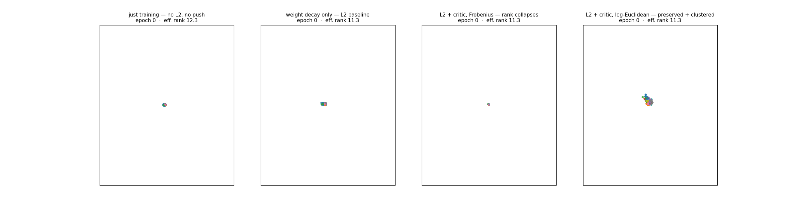

# Gram Critic

**Using set-transformer to read another network's *activation geometry* and act as a regularizer**

Testing a learned critic that sees the gram matrices of a network's
activations predicts "where validation would push the features to generalize better," and injecting
that as a regularizer. Moderately beats weight decay alone on corrupted MNIST at both high *and*
moderate label noise.

---

## Methodology

We hold out a validation set during corrupted training. We propose that the validation set gradient, computed from one step of SGD over the val set could improve model generalization. We approximate the val set gradient as an update to gram matrix of a batch of activations during training. A set transformer, called **Gram Critic** in this project is trained on thousands on frames from training trajectories to predict the gram update given the current activation gram. Through its prediction of gram updates, the gram critic can provide guidance to the activation space geometry during training, acting as a learned regularizer.

1. **Sample Order Invariant Geometry -**  Summarize a layer's activations by their centered Gram matrix
  `K = HHᵀ`. It's invariant to sample order *and* feature rotation, so a critic trained on it  transfers across networks (any width, any seed). The critic does require a fixed batch size.
2. **Learn the validation velocity field.** Train a set-transformer **critic** to predict `ΔK` —
  how *one step of training on the uncorrupted holdout set* reshapes that Gram — from the activation space Gram geometry  alone.
3. **Deploy with no labels.** While training a fresh classifier on noisy labels, periodically pull
  its activation Gram toward `K + ΔK_predicted`. The critic supplies the validation direction;
   no validation labels are touched.

```
  activations ──► Gram K ──►  [ Gram Critic ]  ──► ΔK̂  ──► pull K toward K+ΔK̂   (regularizer)
                              (set transformer)                                  no val labels
```

## Results

Test accuracy of a fresh classifier trained on noisy MNIST (3 seeds), under three regularizers: none,
tuned weight decay (the standard baseline), and the labels-free critic with its `ΔK` matched onto the
live Gram on the PSD manifold (log-Euclidean). The critic is applied on top of the same tuned weight
decay. Effective rank of the learned representation is reported alongside the critic.

| corruption | no regularizer | tuned L2 | **L2 + critic (log-Euclidean)** | critic eff-rank |
| ---------- | -------------- | -------- | ------------------------------- | --------------- |
| **90%**    | 0.253          | 0.356    | **0.450** *(+0.094)*            | 25 *(preserved)* |
| **60%**    | 0.675          | 0.800    | **0.831** *(+0.031)*            | 13 *(preserved)* |

The critic improves on tuned weight decay at both noise levels (+0.094 at 90%, +0.031 at 60%) while
preserving representational rank, and is the only method evaluated here that is positive across the
full noise range at a single fixed operating point. The matching geometry is what makes this possible:
the same `ΔK` matched in the Euclidean metric instead collapses the representation and loses the gain
at moderate noise (see [Matching metric](#matching-metric-frobenius-vs-log-euclidean)). The oracle
ceiling and the per-metric breakdown are deferred to that section.

## Visualizations

The collapse animation (`make viz VIZ_CONFIG=configs/viz_collapse.yaml`) shows penultimate
activations (2D PCA, colored by *true* class) with a live effective-rank readout, in four runs that
share an initialization and differ only in the regularizer:



> Two **baselines** then the **same critic two ways**, all on 90%-noisy labels:
> **(1) just training** — no weight decay, no push: rank stays moderate (~12) but the classes never
> separate; the labels alone teach no structure. **(2) weight decay only** — the L2 baseline the
> deploy tables keep in every row: still no class structure (rank ~7). **(3) L2 + critic, Frobenius** —
> the critic's push under the Euclidean metric contracts the cloud onto a line (rank → 1.2).
> **(4) L2 + critic, log-Euclidean** — the *same* critic, *same* push, matched on the PSD manifold:
> rank stays full (~24) **and** the classes pull apart. The two baselines establish that neither
> training nor weight decay builds this structure; the Frobenius-vs-log-Euclidean comparison isolates
> the matching geometry, rather than the predicted signal, as the factor controlling rank collapse.


Raw logs behind every table below are committed under [`results/`](results/) for checking.

## Findings

- **Rank collapse depends on the Gram-matching metric.** Under Frobenius matching the learned push —
and even the *oracle* push — collapses the representation to rank ~1.5 (the third panel of the
animation above). This is a property of the metric, not of the method: under the log-Euclidean metric
the *same* signal preserves rank and roughly doubles the oracle gain (see *Matching metric*). Collapse
is cheap to satisfy in the Euclidean norm, not inherent to pushing Grams.
- **Determinism and on-policy data matter.** The critic's target must be a deterministic function of
the activation state (one fixed-size validation step, not a variable number), and the training data
must include the *propagated* states the critic will see at deploy — hence the **velocity-field**
formulation (walk the trajectory, record the local one-step `ΔK`).
- **The approximation ceiling is information-bound, not compute-bound.** A controlled sweep (batch 32,
40 epochs, config-held-out, on a fixed 20k subset) isolates the levers: a well-trained `d=32` critic
reaches **cos 0.201** with the true `ΔK` (vs ~0.07 for a mean-direction baseline), `d=64` only
**0.216** (+0.015 for 4× the params), and the full 92k zoo at `d=32` lands at **0.205** — i.e. 4.6×
more data buys ≈+0.004.
Earlier "20k→0.17" numbers were themselves under-converged; with enough gradient steps 20k already
reaches ~0.20. The limit is therefore not data or width but an **information ceiling at cos ≈
0.20–0.22** on how predictable `ΔK` is from the input Grams. Parameterization does not break it
either: an exact rank-≤2C structured head (`ΦCΦᵀ`) underperforms (see *Limitations*), because the
free head already predicts in the right low-rank subspace.
  - That it is possible to predict a *validation* training step from mid-training activation geometry
  at all was not obvious — the partial success here is the interesting part, and once routed through
  the right (log-Euclidean) geometry the noisy learned `ΔK` is the most regime-robust regularizer in
  the comparison.

## Running the Experiment

```bash
pip install -e .          # torch, numpy, pyyaml, matplotlib
make data                 # download MNIST
make zoo                  # generate the velocity-field ΔK dataset   (configs/zoo.yaml)
make train                # fit the Gram Critic                       (configs/critic.yaml)
make deploy               # the headline log-Euclidean table at c=0.9 (configs/deploy_c09.yaml)
make deploy-c06           # same at c=0.6
make viz                  # render the transport animation            (configs/viz.yaml)
make viz VIZ_CONFIG=configs/viz_collapse.yaml   # the headline collapse-vs-preserve animation
```

`make deploy` reproduces the **Results** table (log-Euclidean matching, rank-preserving). The
collapse-prone Frobenius contrast from the *Ablations* section is
`make deploy DEPLOY_CONFIG=configs/deploy_c09_frobenius.yaml`.

Every experiment's knobs are a declarative YAML config (the in-code defaults are training-loop
constants, not experiment parameters). Override any of them:
`make train CRITIC_CONFIG=configs/my_critic.yaml`.

## Layout

```
gram_critic/
  gram.py      Gram / label-Gram / effective-rank / activation-gradient
  models.py    the MLP under study (features / head split)
  reg.py       the Regularizer base class — the optimizer-style lifecycle (register / clear / penalty)
  regularizers.py  the concrete zoo — WeightDecay, the rules, the critic — + ΔK deliveries + factory
  harness.py   the single training loop + seed-averaged evaluation (varies only by Regularizer)
  rules.py     handcrafted Gram-rule zoo (vicreg / soft_ln / log_det / ...)
  routing.py   Gram matching metrics (Frobenius vs log-Euclidean)
  critic.py    the Gram Critic (set-transformer over K×K Grams)
  zoo.py       velocity-field ΔK dataset generation (memmap, > RAM)
  train.py     config-driven critic training (config-held-out cosine, best-val)
  deploy.py    critic-as-regularizer + L2/oracle/amortized evaluation, under any matching metric
  ablation.py  oracle deliveries — what survives the Gram projection
  viz.py       transport-arrow, side-by-side, and collapse-vs-preserve activation animations
configs/       zoo / critic / deploy{,_c06,_c09_frobenius} / ablation / viz{,_collapse,_compare}
experiments/main/   the curated experiments behind the README tables (the rest are gitignored)
results/       the raw run logs those tables cite (so every number is checkable)
Makefile       the pipeline, readable end to end
```

Every experimental condition — weight decay, the handcrafted Gram rules, and the learned critic —
is a `Regularizer` (`reg.py`), trained by the one loop in `harness.py`. The regularizer is the
*only* axis that varies between conditions, so the experimental control is enforced by the type
system rather than by discipline.

## Ablations

Three controls characterize the mechanism, all under Frobenius matching (resolved in the next
section):

- **Random-push control.** A random `ΔK` of identical magnitude to the critic's gives only +0.010 @
rank 7.8, well below the critic's +0.10. The gain comes from the critic's learned direction, not from
push magnitude or generic collapse.
- **Magnitude sweep.** Rank preservation and gain size trade off and do not coexist: a gentle push
(`reg_lambda≈0.1`) preserves rank and does not hurt (+0.002 at c=0.6, +0.013 at c=0.9) but is small;
the strong push that gains +0.10 at c=0.9 does so by collapsing rank to ~1.5, which helps under
extreme noise but hurts (−0.038) at moderate noise.
- **Anti-collapse test.** Adding an activation-only term that prevents the collapse (minimize
`‖C/tr(C)‖²_F`): once it is strong enough to restore rank (eff-rank 1.5 → 13.5 at c=0.9), the +0.10
gain disappears (→ −0.001) while c=0.6 turns slightly positive (+0.014).

Taken alone, these controls suggest the gain is inseparable from a noise-specific capacity collapse.
That conclusion is specific to Frobenius matching, which all three controls use. Changing only the
matching metric, as in the next section, recovers the gain and rank preservation together.

## Matching metric: Frobenius vs log-Euclidean

The Gram is a PSD matrix, so matching it in the Euclidean norm `‖K − K_target‖²_F` is the wrong
geometry: a low-rank `K` matches cheaply, so Frobenius matching rewards rank collapse. The
log-Euclidean metric makes driving an eigenvalue to zero arbitrarily costly. Matching the *same* `ΔK`
under each metric — with nothing else changed — gives (`gram_critic/routing.py`,
`experiments/main/gram_routing.py`; tuned L2 kept in every row):


| `ΔK` matched under                  | c=0.9                     | c=0.6            |
| ----------------------------------- | ------------------------- | ---------------- |
| **oracle**, Frobenius               | +0.213 @4.6               | +0.030 @5.9      |
| **oracle**, log-Euclidean           | **+0.548 @8.8**           | **+0.118 @9.1**  |
| **amortized critic**, Frobenius     | +0.102 @1.5 *(collapsed)* | −0.038 @1.7      |
| **amortized critic**, log-Euclidean | **+0.094 @25.2**          | **+0.031 @12.8** |


- Under the log-Euclidean metric the oracle gain more than doubles (+0.213 → +0.548 at c=0.9) and the
representation stays full-rank. The collapse under Frobenius is therefore a property of the matching
metric, which suppresses the smaller eigenvalues, not of pushing the Gram itself.
- The amortized critic improves on tuned L2 at both noise levels with rank preserved (+0.094 @rank25,
+0.031 @rank13) — the rank-preserving result the Frobenius deployment does not reach.
- The critic recovers +0.094 of the +0.548 oracle ceiling; its `ΔK` has cosine ≈0.21 with the true
target. The validation signal projected through the Gram cannot be predicted exactly, but a usable
fraction of it is recoverable from activation-space geometry alone.

## Heuristic Gram-rule zoo — handcrafted baselines

How good is a *learned* critic versus a one-line geometric rule? These Gram rules can be thought of as **soft,
regularizer-form analogs of normalization layers** (LayerNorm/BatchNorm enforce hard; these enforce
softly): defined in `gram_critic/rules.py`, compared in `experiments/main/gram_rule_zoo.py`. Each `reg`
is added *on top of* L2. Values are **Δacc vs L2 @ effective-rank**; each rule is shown at its
best-c=0.9 λ. The `learned critic` row here is the **Frobenius** deployment, kept for contrast; the
rank-preserving **log-Euclidean** critic from *Results* is the one positive across both regimes.


| rule                                     | what it is                                 | c=0.9 (L2 0.356) | c=0.6 (L2 0.800) |
| ---------------------------------------- | ------------------------------------------ | ---------------- | ---------------- |
| oracle *(uses val set labels — ceiling)* | true `ΔK`                                  | +0.213 @4.6      | +0.030 @5.9      |
| **vicreg**                               | variance-floor + decorrelation             | **+0.158 @13.2** | −0.026 @10.6     |
| soft_ln                                  | soft LayerNorm (sphere)                    | +0.100 @17.0     | −0.043 @10.3     |
| *learned critic (Frobenius)*             | *predicted ΔK, Euclidean match*            | *+0.102 @1.5*    | *−0.038 @1.7*    |
| **learned critic (log-Euclidean)**       | *same ΔK, PSD-manifold match*              | **+0.094 @25**   | **+0.031 @13**   |
| ellipsoid                                | soft LayerNorm (Mahalanobis)               | +0.081 @4.1      | −0.033 @5.0      |
| decorrelation                            | Barlow Twins                               | +0.019 @4.9      | −0.003 @7.4      |
| **log_det**                              | MCR² coding volume                         | +0.017 @7.9      | **+0.014 @7.9**  |
| uniformity                               | Wang–Isola                                 | −0.168 @10.1     | +0.016 @8.3      |


- At high noise `vicreg` and `soft_ln` gain more than either critic deployment (+0.158 / +0.100 @ rank
13–17), with no zoo, no training, and no labels. A one-line geometric rule is a strong baseline, and a
learned `ΔK` is not required to beat tuned L2 in this regime — a reminder to compare against the fixed
baseline before crediting the learned component.
- No single handcrafted rule is robust across noise: `vicreg` and `soft_ln` go negative at c=0.6, and
only `log_det` is positive at both noise levels, marginally (+0.017 / +0.014). The log-Euclidean critic
is positive at both (+0.094 / +0.031) with rank preserved; its advantage is regime-robustness rather
than peak magnitude.
- `ellipsoid` (Mahalanobis) underperforms its Euclidean counterpart `soft_ln`, as expected: the inverse
covariance rewards deleting weak directions, a latent collapse incentive.

## Gram Reconstruction of Full Gradient

Three *oracle* deliveries of the validation signal (all use true labels; same training, different
representation pushed through), via `make ablation`. Notably, the full gradient cannot be recovered from the gram update given the gram's invariances.

The honest comparison is the two **validation-gradient** deliveries — they use the true-label
*gradient* `g_h = ∂CE/∂h`, the nudge a held-out labeled val set gives and the signal the critic
amortizes:


| delivery                                              | c=0.6  | c=0.9  | eff-rank (c=0.9) |
| ----------------------------------------------------- | ------ | ------ | ---------------- |
| L2 (baseline)                                         | 0.800  | 0.356  | 7.7              |
| `direct` — push along `−g_h` (full activation signal) | +0.057 | +0.409 | 6.2              |
| `gram_gradient` — route `g_h` through the Gram        | +0.030 | +0.213 | 4.6              |


- **The Gram carries ~half the signal:** `gram_gradient` is consistently ≈ ½ of `direct` — the
rotation-invariant component survives, the rest is the *invariance floor* the amortized critic also
pays.
- **Both `g_h` pushes preserve rank** (they're the correct direction), so the critic's deploy collapse
is a *prediction-error* artifact, not intrinsic to Gram-pushing.

> A third delivery, `match Gram(h) → label-Gram(true labels)`, scores higher (+0.508 @ c=0.9) but is
> **cheating, not a result**: it stamps the *clean-label* cluster structure directly onto the features
> — supervised training on uncorrupted labels in Gram form, not a validation *direction* and not
> amortizable. It's kept in the code only as a labeled full-supervision ceiling.

## Limitations & conclusion

A labels-free critic that reads only activation Grams *can* be a useful regularizer:
deployed on the PSD manifold (log-Euclidean) it beats tuned weight decay at both 90% and 60% label
noise while preserving rank, and it's the only method here robust across the noise range at one fixed
operating point. 

Notably, this experiment transfers validation geometry from the MNIST task to itself. 
A natural next step would be to see if a learned activation-space critic trained on one or more tasks can transfer gains to a unseen task. 


